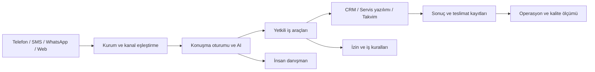

# Cognivault: mevcut durum, rakipler ve oto servis yönü

İnceleme tarihi: 23 Eylül 2026. Kod tabanı: `d6fb251` üzerine bu çalışmada eklenen otomotiv pilotu. Kaynaklar şirketlerin resmî sayfaları, resmî ürün dokümanları ve yerel kod incelemesidir. Bu rapor şirketlerin kapalı mimarilerine erişildiği veya canlı müşteri performanslarının bağımsız ölçüldüğü anlamına gelmez.

## Karar

**Cognivault güçlü bir geliştirme/pilot altyapısı; henüz gerçek müşteride kanıtlanmış, çok sektörlü bir ses operasyonu ürünü değil.** Rakiplerle kapanması gereken ana fark yeni bir model geliştirmekten önce gerçek telefon, gerçek şirket verisi, güvenilir işlem ve ölçülen saha sonucudur.

Oto servis için önerilen ilk ürün: **izinli müşterilerin kayıtlı bakım planını takip eden, güncel servis kapasitesinden randevu alan ve istisnaları danışmana aktaran dijital servis asistanı.** İlk teklif “her şeyi yapan AI çağrı merkezi” yerine tek şube ve ölçülebilir tek süreç olmalı. Bu çalışmada bu ürünün aday seçimi ve operatör provası kuruldu; canlı bağlantı ihtiyaçları aşağıda ayrı gösterildi.

## 1. Proje şu anda nerede?

| Alan | Kodda görülen durum | Ticari anlamı |
|---|---|---|
| Uygulama | React/TypeScript panel, FastAPI, SQLAlchemy; yerelde SQLite, dağıtımda PostgreSQL | Sıfırdan başlamıyoruz |
| Erişim | JWT kimlik doğrulama, roller, kurum/klinik kapsamı ve izolasyon testleri | Temel var; her eski yolun kurumsal SaaS için ayrıca incelenmesi gerekiyor |
| Randevu | Genel randevu ve daha gelişmiş klinik slot/rezervasyon yolları | Otomotiv kapasitesi henüz modellenmemişti |
| AI | Yerel/OpenAI uyumlu çalışma zamanı, kural tabanlı geri dönüş, klinik politika/izin kapıları | Model sağlayıcısı değiştirilebilir; esas ürün iş kuralları ve araçlar |
| Ses | Whisper/Piper ve harici sağlayıcı seçenekleri, Voice Studio, Twilio telefon webhook'ları | Tarayıcıda çalışan ses ile gerçek telefonun aynı yol olmadığı unutulmamalı |
| Operasyon | Denetim, metrik, readiness, outbox/retry/dead-letter, dağıtım ve yedek provası araçları | İyi temel; bazı sağlayıcı işleyicileri hâlâ demo |
| Kurumsal entegrasyon | HBYS adapter sözleşmesi ve bellek içi dayanıklılık örneği | Gerçek satıcı entegrasyonu yapıldığı anlamına gelmez |
| Bulut | Production Compose, Caddy/TLS, migration, ayrı worker | Tek sunucu dağıtım paketi var; yönetilen bulut/SLA kanıtı yok |
| Saha | Yol haritasında gerçek telefon araması ve müşteri pilotu açık | Yerel dosyalarda bunların tamamlandığını doğrulayan yeni kanıt bulunmadı |

Kanıt dosyaları: `backend/app/main.py`, `backend/app/api/dependencies.py`, `backend/app/services/appointment_service.py`, `backend/app/services/clinical_slot_service.py`, `backend/app/ai/runtime.py`, `backend/app/ai/voice_factory.py`, `backend/app/services/outbox_service.py`, `backend/app/integrations/hbys.py`, `docker-compose.prod.yml`, `docs/ROADMAP-2026-09.md`.

### Canlıya geçmeden çözülmesi gereken somut bulgular

1. **Telefon karşılaması kliniğe sabit.** `backend/app/api/routes/clinical.py` içindeki `/webhooks/voice/incoming`, “medikal asistan / Selin” metni kullanıyor. Kurum çözümü sonraki `/gather` adımında. Oto servis numarasını bu yola bağlamak yanlış marka ve sektörle karşılar. Numara → kurum → sektör profili çözümü ilk adıma taşınmalı.
2. **Outbox işleyicileri gönderim kanıtı değil.** `handler_send_whatsapp` ve `handler_send_email` log yazan demo fonksiyonları. Worker'ın olayı `dispatched` yapması gerçek teslimat demek değil. Gerçek sağlayıcı kimliği, durum callback'i ve `queued/accepted/delivered/failed` ayrımı gerekli. SMS'in ayrı sağlayıcı yolu bulunması bu iki işleyiciyi canlı yapmıyor.
3. **Eski genel randevu yolu otomotiv için güvenli yeniden kullanım hedefi değil.** `check_available_slots` kurum filtresi almıyor; `create_appointment` önce `is_booked` okuyor, sonra yazıyor. Bu yolun çok kiracılı izolasyonu ve eşzamanlı iki rezervasyon davranışı ayrıca ele alınmalı. İnceleme, tüm klinik randevu yollarında aynı sorun olduğu iddiası değildir.
4. **Kurum yoksa varsayılan kuruma düşme davranışı var.** `get_current_organization`, eski kullanıcılar için ilk kurumu seçebiliyor. Çok müşterili servis ürününde eksik kurum bağını sessizce kabul etmek yerine reddetmek gerekir.
5. **Sesin yerel olması uçtan uca yerellik demek değil.** Web/Studio'da lokal STT varken belgelenen telefon yolu Twilio STT kullanıyor. Ses, metin, kayıt, log ve model akışlarının tümü ayrı envantere alınmalı.
6. **README eski durumla karışmış.** Hâlâ bazı mevcut özellikleri gelecekte yapılacaklar arasında ve kimlik doğrulamayı “mock” olarak anlatıyor. Ürün kararı README'ye değil koda ve güncel yol haritasına dayanmalı.

Bunlar otomotiv ekleme kapsamından bağımsız genel güvenlik düzeltmeleri olarak uygulanmadı; değişikliklerin klinik ürün üzerindeki etkisi ayrı değerlendirilmelidir. Yeni pilot hiçbir eski randevu veya gönderim yolunu çağırmaz.

## 2. Freya, Luron ve benzerleri bunu nasıl yapıyor?

| Şirket | Kamuya açık olarak doğrulanabilen yaklaşım | Bizim için ders |
|---|---|---|
| Freya | SIP telefon, görüşme sırasında API, görüşme sonunda webhook; Türkiye bulutu/on-prem seçenekleri. Kampanya dokümanında müşteri listesi, çalışma saatleri, deneme sınırı ve sonuç takibi var. | Şirketin süreçlerine bağlanmak ve kontrollü kampanya işletmek ürünün merkezinde |
| Luron | Telefon, mesajlaşma ve CRM/takvim entegrasyonu, insan devri anlatıyor. Otomotiv sayfası ağırlıkla aday müşteri, test sürüşü ve satış takibine odaklı. | Biz satış öncesi yerine bakım sonrası servis operasyonunda daha dar bir başlangıç seçebiliriz |
| Retell | Kendi muhakeme katmanını WebSocket üzerinden bağlama; telefon/ses/kesilme yönetimini sağlayıcıya bırakma seçeneği sunuyor. | İlk saha denemesi için tüm ses altyapısını kendimiz geliştirmek zorunda değiliz |

Kaynaklar: [Freya entegrasyonları](https://www.freyavoice.ai/tr/entegrasyonlar), [Freya kampanya dokümanı](https://docs.freyavoice.ai/guides/features/campaigns), [Luron platformu](https://www.luron.ai/), [Luron otomotiv](https://www.luron.ai/industries/car-dealerships), [Retell özel model bağlantısı](https://www.retellai.com/integrations/custom-llm).

Freya ayrıca kendi Türkçe ses modellerini yayımlıyor; bu, genel bir dil modelini API'den çağırmanın ötesinde bir yatırım. Bizim mevcut avantajımız böyle bir ses modeli sahipliği olarak sunulmamalı. [Freya model deposu](https://huggingface.co/freyavoice/Freya-TTS).

Luron'un %70 maliyet azalması, 500 ms gecikme ve %99,99 SLA gibi rakamları **pazarlama/sözleşme iddialarıdır**; bu incelemede bağımsız olarak doğrulanmadı. Bunları bize hedef veya garanti olarak kopyalamamak gerekir. Luron'un iç model sağlayıcısı, gerçek kapasite sınırı ve maliyet yapısı bu sayfalardan çıkarılamaz. Freya'nın ayrıntılı workflow sayfası erişim hatası verdi; kampanya ve entegrasyon dokümanlarından yararlanıldı.

### Ortak ürün mimarisi — kaynaklardan yapılan çıkarım

AI müşterinin niyetini ve eksik bilgiyi anlar. Bakım tarihi, fiyat, uygun saat, işlem yetkisi ve rezervasyon sonucu şirket sisteminden gelir. Başarı “iyi konuştu” değil, doğru işlem ve izlenebilir sonuçtur.

## 3. Örnek müşteri: Atlas Oto Servis

Tamamen kurgusal şirket. Tek şube, danışman ekibi ve kaynak servis yazılımı varsayıldı; gerçek müşteri, telefon, marka bağlantısı veya kapasite iddiası yoktur.

### İlk süreç: kayıtlı bakım planından randevuya

1. Kaynak servis yazılımından müşteri–araç ilişkisi, kayıtlı sonraki bakım tarihi/km eşiği, son km ölçüm tarihi, izin ve aktif randevu okunur.
2. Bakım tarihi önümüzdeki 30 gün içindeyse veya güncel km kaydı servisçe belirlenen eşiğe ulaşmışsa aday olur. Tarih ve kilometre birbirinin yerine uydurulmaz.
3. İzin, ret, son temas, sahiplik ve veri güncelliği kontrolleri uygulanır. Eksik bilgi insan kontrolüne gider.
4. Danışman ilk kampanya grubunu inceler. Telefon/mesaj sağlayıcısı bağlandıktan sonra müşteriye uygun zaman ve kanalda ulaşılır.
5. Müşteri isterse bakım türüne uygun lift, teknisyen ve süre kaynak takviminden sorgulanır. Müşteri onayı ve kaynak sistem rezervasyon sonucu olmadan “randevunuz oluşturuldu” denmez.
6. Sonuç kaydedilir; başka yerde bakım yaptırma, ret, yanlış kişi, insan talebi ayrı iş akışları olur.

**Örnek mesaj:** “Merhaba Deniz, Atlas Oto Servis dijital asistanıyım. Servis kayıtlarımızda sonraki bakım tarihiniz 05.10.2026 olarak görünüyor. Bakımınızı başka bir yerde yaptırdıysanız kaydımızı güncelleyebiliriz. Dilerseniz uygun servis saatlerini kontrol edelim. Bu hatırlatmaları almak istemiyorsanız İPTAL yazabilirsiniz.”

Bu, gönderilmemiş bir örnektir. Canlı SMS başlığı, işletme kimliği, ret yöntemi ve kanal şablonu gerçek sağlayıcı/uyum kurulumu sırasında kesinleştirilir. Telefonda önce kendini tanıtma ve uygunluk; özel kayıt bilgisi paylaşmadan kişi/araç eşleşmesi gerekir.

### Diğer süreçlerin sırası

| Öncelik | Süreç | Gereken doğruluk |
|---|---|---|
| 1 | Gelen randevu taleplerini karşılama | Kapasite ve müşteri onayı |
| 1 | Kayıtlı bakım hatırlatması | Doğrulanmış plan, güncel izin |
| 2 | Mevcut randevu hatırlatma/erteleme | Güncel rezervasyon ve değişiklik sonucu |
| 2 | Araç hazır bildirimi | Gerçek iş emri “teslime hazır” olayı |
| 3 | Bakım sonrası memnuniyet/şikâyet | Gerçek tamamlanmış iş, insan devri |
| Daha sonra | Kampanya ve ek satış | Ayrı pazarlama amacı, izin ve ürün doğruluğu |

Model arıza teşhisi, güvenli sürüş garantisi, kesin fiyat veya doğrulanmamış parça stok sözü vermez. Fren/duman vb. güvenlik riski anlatımı normal kampanya akışını keser ve gerçek servis/yol yardımına yönlendirilir.

## 4. Şirketler sistemi nasıl kullanır?

**Müşteri tarafı:** Mevcut numarayı arar, izinli mesajı yanıtlar veya web bağlantısından talep bırakır. Ayrı AI uygulaması kurması gerekmez.

**Servis çalışanı:** Tarayıcıdan kendi kurum paneline girer; hangi kaydın neden aday olduğunu, hangi görüşmenin danışmana devredildiğini ve hangi randevunun kaynak sistemde gerçekten oluştuğunu görür. Sabah istisnaları, gün içinde talepleri, gün sonunda sonuçları takip eder.

**Kurulum ekibi:** Numara/kanalı kuruma bağlar, servis yazılımı alanlarını eşler, izin kaynağını tanımlar, çalışma saatlerini ve bakım türlerini yükler, prova yapar. Her müşteriye yeni bir kod kopyası üretmek yerine ortak çekirdek + kurum ayarı + sektör adapteri kullanır.

**Bizim ticari model önerimiz:** Başlangıçta kurulum/entegrasyon bedeli + aylık platform/operasyon bedeli + açıkça gösterilen kullanım maliyeti. Başarıya bağlı ücret ancak kaynak sistemde tekilleştirilmiş ve iptal/gelmeme kuralları belirlenmiş sonuçla hesaplanmalı. Fiyatlar tedarikçi teklifi ve pilot ölçümü olmadan uydurulmamalı.

## 5. Bulut servislerine entegre edebilir miyiz?

**Evet.** Mevcut konteyner paketi ilk aşamada bir bulut sunucusunda çalışmaya uygun bir başlangıçtır; bu araştırmada hiçbir bulut hesabı açılmadı, kaynak satın alınmadı veya deployment yapılmadı.

| Seçenek | Önerilen yerleşim | Karar |
|---|---|---|
| İlk pilot: Türkiye'de tek sunucu | Caddy + API + frontend + PostgreSQL + worker; ayrı yerde şifreli yedek | Mevcut paketle en kısa yol; tek sunucu arızası riski var |
| Yönetilen AWS | API/worker için ECS; RDS PostgreSQL; obje deposu; Secrets Manager; yük dengeleyici/izleme | Büyümede operasyon kolaylığı; bölge ve veri aktarımı incelenmeli |
| Yönetilen Google Cloud | Web/API için Cloud Run, Cloud SQL, obje deposu; uygun ayrı worker/voice servisi | Web işlerine uygun; uzun ses bağlantısı, durum paylaşımı ve timeout tasarımı şart |
| Müşteri içi sunucu | Aynı konteynerler + yerel modeller + kurum ağı | Veri kontrolü yüksek; donanım, güncelleme ve destek yükü daha yüksek |

Bunlar önerilen eşlemelerdir; hazır Terraform veya denenmiş çok bölgeli altyapı oldukları iddia edilmez. AWS tarafında sırlar Secrets Manager/Parameter Store üzerinden sağlanabilir. Cloud Run WebSocket bağlantıları da istek zaman aşımına tabidir; kesilmeyen sınırsız telefon hattı gibi varsayılmamalı. [AWS sır yönetimi](https://docs.aws.amazon.com/AmazonECS/latest/developerguide/specifying-sensitive-data.html), [Cloud Run WebSockets](https://docs.cloud.google.com/run/docs/triggering/websockets).

İlk aşamada Kubernetes gerekmez. Önce gerçek trafik, eşzamanlı çağrı sayısı ve işlem gecikmesi ölçülmeli. Çok kopyalı kurulumdan önce oturumların process belleğinde kalması, dosya/ses cache'lerinin paylaşılması, worker tekilleştirme ve rezervasyon atomikliği ele alınmalı.

### İzin ve veri yerleşimi

“Bakımınızı bizde yaptırın” satışa yönlendiren içeriği sırf bakım sözcüğü geçtiği için işlemsel bildirim saymamak gerekir. Ticari ileti amacı ve istisnalar servisle birlikte sınıflandırılmalı; pilot, belirsizliği izin varmış gibi yorumlamaz. İYS kanal bazlı onay/ret yönetimi sağlar. Pilot içindeki izin alanı, gerçek İYS entegrasyonu veya hukukî uygunluk belgesi değildir. [İYS açıklaması](https://iys.org.tr/iys/nedir), [İYS SSS](https://iys.org.tr/iys/sss).

WhatsApp için işletme başlatımlı görüşmelerde onaylı şablon, müşteri mesajından sonraki 24 saat dışındaki yanıtlar için şablon ve açık insan devri yolu dikkate alınmalı. SMS izni otomatik olarak WhatsApp izni kabul edilmemeli. [Meta politikası](https://whatsappbusiness.com/policy/).

Yurt dışına veri aktarımı yalnızca bir “rıza” kutusuyla çözülmüş sayılmaz. KVKK'nın güncel aktarım rejimi uygun güvence yöntemleri, standart sözleşmeler ve ilgili koşulları içeriyor. Sunucunun Türkiye'de olması da harici telefon/model/log sağlayıcılarını yerel yapmaz. Veri akışı ve işleyen sözleşmeleri gerçek sağlayıcı seçimiyle değerlendirilmelidir. [KVKK yurt dışına aktarım](https://www.kvkk.gov.tr/Icerik/2053/Yurtdisina-Aktarim).

## 6. Nasıl ilerlemeliyiz?

- **İlk 3–5 iş günü (tahmin):** Bir servisin alan örnekleri, izin kaynağı, takvim kapasitesi ve sağlayıcı erişimi alınır; güncel veri eşleme tamamlanır.
- **Sonraki 1–2 hafta (erişime bağlı tahmin):** Gerçek DMS adapteri, ret kaydı, gönderim/teslimat callback'leri, kapasite ve tekilleştirme; test numaralarıyla uçtan uca prova.
- **Sonraki 2–4 hafta (pilot):** Küçük izinli grup, danışman gözetimi, kademeli otomasyon. Sağlayıcı onayları süreyi uzatabilir.

Kabul ölçümleri: yanlış kişiye veri açıklama = 0; ret sonrası yeniden temas = 0; çift rezervasyon = 0; her onaylı randevunun kaynak sistem kimliği var; her gönderimin sağlayıcı durumu izlenebiliyor. Operasyon metrikleri: aday → ulaşılan → isteyen → onaylanan → gerçekten gelen dönüşümü; insan devri oranı; konuşma gecikmesi p50/p95; tamamlanmış servis başına toplam maliyet. Öncesi/sonrası veya kontrol grubu olmadan “ek gelir” iddiası kurulmaz.

Test sonuçları ve çalıştırma bilgisi: [Pilot kurulum dosyası](./PILOT-KURULUMU.md).
