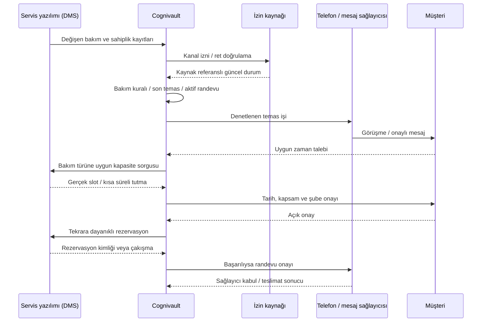

# Atlas Oto Servis — pilot kurulumu ve entegrasyon sözleşmesi

Bu şirket kurgusaldır. Modül iki katmandan oluşur:

1. **Bakım adayı seçimi + görüşme provası** (`pilot.py`) — veritabanına yazmaz.
2. **Yol yardımı ve servis operasyonları** (`operations.py`) — 15 hizmet türü, çekici iş takibi, konuma göre ekip eşleştirme. İşler **`automotive_cases` tablosuna kalıcı yazılır** (migration `0013_automotive_cases`); ekipler örnek kayıttır.

Canlı DMS/CRM, İYS ve SMS/WhatsApp **teslimat** bağlantısı yoktur. Telefon köprüsü (`phone.py`) kodda vardır ama **varsayılan kapalıdır** (`AUTOMOTIVE_VOICE_ENABLED=false`); açılınca yalnız ayarlarda tanımlı dispeç numarasına aktarır. Mevcut klinik kayıtlarını değiştirmez.

## Çalıştırma

Mevcut yerel kurulumda iki terminalde `./scripts/run_backend.sh` ve `./scripts/run_frontend.sh` çalıştırın. Operatör/yönetici hesabıyla giriş yaptıktan sonra **Oto Servis Pilotu** bağlantısını veya `http://localhost:5173/automotive` adresini açın. Yerel örnek operatör hesabı: `operator@cognivault.com`, şifre `demo123`. Bunlar yalnız demo verisi içindir.

Bu incelemede ekran ayrıca mevcut veriyi değiştirmeyen `/tmp/cognivault-auto-pilot-preview.db` ile çalıştırıldı. Geçici sunucu durdurulduktan sonra yukarıdaki normal başlangıç betikleri kullanılabilir.

Arayüz olmadan, repo kökünden:

```bash
cd backend
.venv/bin/python -m app.automotive
.venv/bin/python -m app.automotive --sample > /tmp/atlas-crm-example.json
.venv/bin/python -m app.automotive --input /tmp/atlas-crm-example.json
```

İlk komut güncel İstanbul tarihine göre sekiz kurgusal kaydı değerlendirir. Beklenen özet: 2 taslak adayı, 1 inceleme, 4 engellenen, 1 zamanı gelmemiş. `--input` dosyası `as_of`, `channel`, `records` içerir. Şema Pydantic ile doğrulanır; aynı araç kimliğini iki kez içeren liste reddedilir. CLI dış servise bağlanmaz.

## Gerçekten eklenen parçalar

| Parça | Yer | Davranış |
|---|---|---|
| Kurallar ve örnek veri | `backend/app/automotive/pilot.py` | Kaynağa dayalı aday seçimi, gerekçe, taslak ve prova sonuçları |
| Yerel veri değerlendirme | `backend/app/automotive/__main__.py` | JSON dosyasıyla prova |
| Yetkili API | `backend/app/api/routes/automotive.py` | Yalnız operatör/yönetici; oturumsuz 401, müşteri 403 |
| Operatör ekranı | `frontend/src/components/automotive/AutomotivePilot.tsx` | Aday listesi, karar gerekçesi, mesaj ve yanıt senaryoları |
| Yol yardımı / servis işleri | `backend/app/automotive/operations.py` | 15 hizmet türü, iş durumu makinesi (konum → ekip → kabul → yolda → ulaştı → teslim), sürüm kontrollü eylemler, tekrar eden olay koruması |
| Kalıcı iş kaydı | `automotive_cases` + `migrations/versions/0013_automotive_cases.py` | Sahip kapsamlı; aynı ekip iki açık işe atanamaz (DB tekilliği) |
| Kanal adaptörleri | `backend/app/automotive/channels.py` | Meta konum mesajı okuma, ekibe konum yükü hazırlama — **gönderim yapmaz** |
| Telefon köprüsü | `backend/app/automotive/phone.py` | Twilio imzalı, varsayılan kapalı; karşılama → dispeç numarasına aktarım → aktarım sonucu |
| Operasyon ekranı | `frontend/src/components/automotive/ServiceOperations.tsx` | İş kartları, ekip seçimi, durum adımları |
| Yol yardım hattı | `backend/app/automotive/roadside.py`, `whatsapp.py` | Telefon/WhatsApp → iş → otomatik ekip teklifi → kabul → yolda → teslim; zaman aşımı; teslim durumu. Ayrıntı: `YOL-YARDIMI.md` |
| Mesaj kayıtları | `automotive_messages` + migration `0014_automotive_roadside` | Müşteri/ekip mesajları ve teslim durumu, iş kaydından ayrı |
| Hat simülatörü | `frontend/src/components/automotive/RoadsideLine.tsx` | Müşteri ve çekici WhatsApp'ı yan yana; yalnız demo modunda |
| API istemcisi | `frontend/src/api/automotive.ts` | Mevcut giriş oturumunu kullanır |
| Testler | `backend/tests/test_automotive.py`, `test_automotive_operations.py` | Sınır, izin, yetki, durum geçişleri, ekip çakışması, telefon imzası |

API:

- `GET /api/automotive/demo`: örnek girdi + değerlendirme.
- `POST /api/automotive/preview`: gönderilen kayıtları değerlendirir; saklamaz ve gönderim yapmaz.
- `POST /api/automotive/rehearsal`: yalnız kurgusal `demo-01` … `demo-08` araçlarıyla yanıt senaryosu. `outcome`: `interested`, `already_serviced`, `opt_out`, `wrong_person`, `price`, `urgent`, `human`.

İçe verilen kayıtların izin/sahiplik alanları **girdidir**, gerçek İYS veya CRM doğrulaması değildir. Üretimde bu değerleri tarayıcıdan doğru kabul etmek yasaklanmalı; güvenilir sunucu adapterlerinden okunmalıdır. Pilot tarihini değiştirmek geçmiş/gelecek senaryo provası içindir; üretim zamanını kullanıcı belirlememelidir.

## Pilot kuralları

Bu eşikler işletme için seçilmiş başlangıç politikalarıdır; üretici bakım standardı veya yasal süre oldukları iddia edilmez.

| Kontrol | Pilot davranışı |
|---|---|
| Bakım tarihi | Kayıtlı sonraki tarih bugün +30 gün veya öncesiyse aday |
| Km eşiği | En fazla 30 günlük ölçüm, kayıtlı eşiğe ulaşmışsa aday; sürüş hızıyla tahmin yok |
| Kaynak güncelliği | Servis eşitlemesi 7 günden eskiyse inceleme |
| Kanal izni | İlgili kanal + izin referansı + değerlendirme günü kontrolü gerekir |
| Ret / sahiplik | Ret varsa veya sahiplik doğrulanmamışsa temas yok |
| Mevcut randevu | Aktif randevu varsa bu kampanyaya alınmaz |
| Sıklık | Son 30 gün temas varsa yeni kampanya taslağı yok |
| Gelecek ölçüm/eşitleme | Veri tutarsızlığı olarak inceleme |
| Bilinmeyen plan | “Bakımınız geldi” denmez; insan incelemesi |

`ready` yalnız “bu örnek veriye göre taslak üretilebilir” demektir; gönderime hazır veya hukuken onaylı demek değildir. Telefon taslağı kişi doğrulamasından önce özel kayıt bilgisini paylaşmaz. WhatsApp taslağı sağlayıcı şablon onayı yerine geçmez.

## Canlı şirket bağlantısının yapısı — sıradaki uygulama



### Veri eşleme sözleşmesi

Canlı şemada her tabloda zorunlu `organization_id`, kaynak sistem kimliği ve sürüm/zaman damgası gerekir. Kurum kimliği payload'dan değil doğrulanmış oturum veya kanal bağından çözülür.

| Kaynak bilgi | Pilot alanı | Canlı doğrulama |
|---|---|---|
| Araç dış kimliği | `vehicle_id` | Kurum içinde tekil, plaka değişiminden bağımsız |
| İsim / araç etiketi | `customer_label`, `vehicle_label` | Minimum bilgi, maskelenmiş panel görünümü |
| Kayıt sürümü | `source_ref`, `synced_on` | API/webhook olay kimliği; tekrar ve sıra kontrolü |
| Sonraki bakım | `next_service_on`, `next_service_km` | Üretici planı/servis kaydı; genel “her araç 10 bin” kuralı yok |
| Güncel km | `odometer_km`, `odometer_on` | Kaynağı ve müşteri beyanı ayrımı |
| İletişim izni | `permitted_channels`, `consent_ref`, `consent_checked_on` | Marka, amaç, kanal, zaman ve ret kaynağı |
| Temas engeli | `do_not_contact`, `ownership_verified` | Yanlış numara, satış/devretme ve ret olayları |
| İş durumu | `open_booking`, `last_contact_on` | Gönderimden hemen önce tekrar okunur |

Gerçek telefon adresi pilot girdisine bilerek dahil edilmedi. Canlı adapter yetkili sunucuda iletişim adresini bulur; LLM'e tam telefon/VIN/kimlik göndermek gerekmez.

### Adapter sorumlulukları

Bunlar **tasarım sözleşmesidir; çalışan satıcı endpoint'leri değildir**:

- `ServiceDataSource.list_changed(cursor)`: şirketin müşteri, araç, bakım ve açık randevu kayıtlarını sayfalı getirir; alan doğrulaması yapar.
- `ConsentGateway.check(customer_ref, brand, channel, purpose)`: güncel izni döndürür; doğrulanamıyorsa temas engellenir. `suppress(...)` kalıcı ret yazar ve bekleyen işleri iptal eder.
- `WorkshopCalendar.find_slots(branch, service_type, duration, vehicle_ref)`: lift/teknisyen/iş süresi ve gerekiyorsa parça uygunluğunu sorgular.
- `WorkshopCalendar.hold(slot, expires_at)` / `book(hold, confirmation, idempotency_key)` / `cancel(...)`: kaynakta atomik kapasite kontrolü. Aynı idempotency anahtarı ve aynı payload aynı sonucu verir; farklı payload çakışma üretir.
- `ChannelGateway.enqueue(...)`: kampanya/iş emri amacı açık olan işi transactional outbox'a yazar. Gönderim öncesi ret ve aktif randevu tekrar kontrol edilir. Sağlayıcı hata/zaman aşımında kör tekrar yerine sonuç uzlaştırması yapılır.
- `DeliveryWebhook.verify(...)`: sağlayıcıya özgü imza, zaman damgası ve tekrar saldırısı kontrolü; `provider_event_id` tekilliği. İletiyi sadece HTTP 200 nedeniyle teslim edildi saymaz.
- `HumanHandoff.create(...)`: özet, neden, doğrulanmış araç ve istenen işlem; başarısız canlı aktarım için geri arama görevi.

Önerilen kalıcı nesneler: `vehicle`, `service_plan`, `consent_event`, `campaign`, `contact_attempt`, `slot_hold`, `service_booking`, `integration_event`. Tekillikler en az `(organization_id, source_system, external_id)` ve `(organization_id, idempotency_key)` üzerinde. Müşteri başına birden fazla araç için temaslar birleştirilmeli; aynı kişiye araç sayısı kadar mesaj gönderilmemeli. Mevcut genel randevu tablosu bu sözleşmenin yerine geçmez.

## Operasyon ve bulut kontrol listesi

- Numara/marka/kurum eşleştirmesi ilk çağrı adımında; eksik eşleme reddedilir.
- İlk pilotta kurum başına ayrı dağıtım/veritabanı işletme riskini azaltabilir; ortak SaaS'a geçişte tüm eski erişim yolları tenant testinden geçer.
- Sırlar sunucu/secret manager'da; frontend'de sağlayıcı anahtarı yok.
- HTTPS webhook, gizli ağda DB, ayrı API/worker, şifreli ve başka hata alanında yedek, geri dönüş provası.
- Saatler `Europe/Istanbul` işletme politikasıyla hesaplanır; zaman damgaları UTC saklanır. Çağrı penceresi ve deneme sınırı uygulama öncesi netleştirilir.
- Kampanya stop anahtarı, bütçe limiti, kapasite limiti ve hata alarmı gerekir.
- Bu pilot kalıcı ret/scheduler sağlamadığından canlı kampanya worker'ına bağlanmamalıdır.

## Doğrulama

- Otomotiv testleri: **171 geçti** (yol yardım hattı dahil, 2026-09-23).
- Frontend testleri: **76 geçti**; TypeScript derlemesi temiz.
- Tam backend test paketi: aşağıdaki Değişiklik Günlüğü'ndeki son kayda bakın; dış ağ kapalı test ortamıdır.
- Tarayıcı kontrolü: örnek operatör girişi, 8 kayıt/özet, randevu provası ve iletişim reddinde taslak/randevu düğmesinin engellenmesi doğrulandı.
- Gerçek telefon, SMS/WhatsApp teslimatı, İYS, DMS rezervasyonu, bulut ve yük testi: **çalıştırılmadı; bağlantılar mevcut değil**.

Test komutları repo kökünden `backend/.venv/bin/python -m pytest backend/tests/test_automotive.py -q`; frontend klasöründe `npm run build` ve `npm run test:run`.

## Canlıya geçiş için servisten alınacak bilgiler

Servis yazılımının adı ve test API erişimi; anonimleştirilmiş alan örnekleri; şube/lift/teknisyen çalışma takvimi; bakım katalogları ve süreler; doğrulanmış numara ve mesaj başlığı; izin/ret kaynağı; insan devri numarası; barındırma/veri yerleşimi tercihi; gerçek pilotun kabul ölçümleri. Bunlar olmadan dış sisteme entegre olmuş gibi gösterilmemelidir.

## Değişiklik Günlüğü

- **2026-09-23** — Yol yardımı/servis operasyonları katmanı (başka bir oturumda
  yazıldı) kaydedildi. Belge bu katmanı hiç anmıyordu ve "migration
  gerektirmez" diyordu; `automotive_cases` tablosu ve `0013` migration'ı
  eklendiği için düzeltildi. Migration'ın bozduğu 3 preflight sabitleme testi
  (head, revizyon sayısı, kayıtlı artefakt) güncellendi. Doğrulama: otomotiv +
  preflight 107 geçti; tam paket bu düzeltmeden önce 5485 geçti / 3 kaldı
  (kalan üçü bu sabitleme testleriydi).
- **2026-09-23 (ii)** — Yol yardım hattı: telefon/WhatsApp'tan gelen talep iş
  açıyor, eksik bilgiyi soruyor, en yakın uygun çekiciye otomatik teklif
  gidiyor, çekici WhatsApp düğmeleriyle ilerletiyor. 24 saat kuralı, şablonlar,
  zaman aşımı ve teslim hatası yönetimi dahil. Ayrıntı: `YOL-YARDIMI.md`.
  Tam paket 5552 geçti / 1 atlandı.
