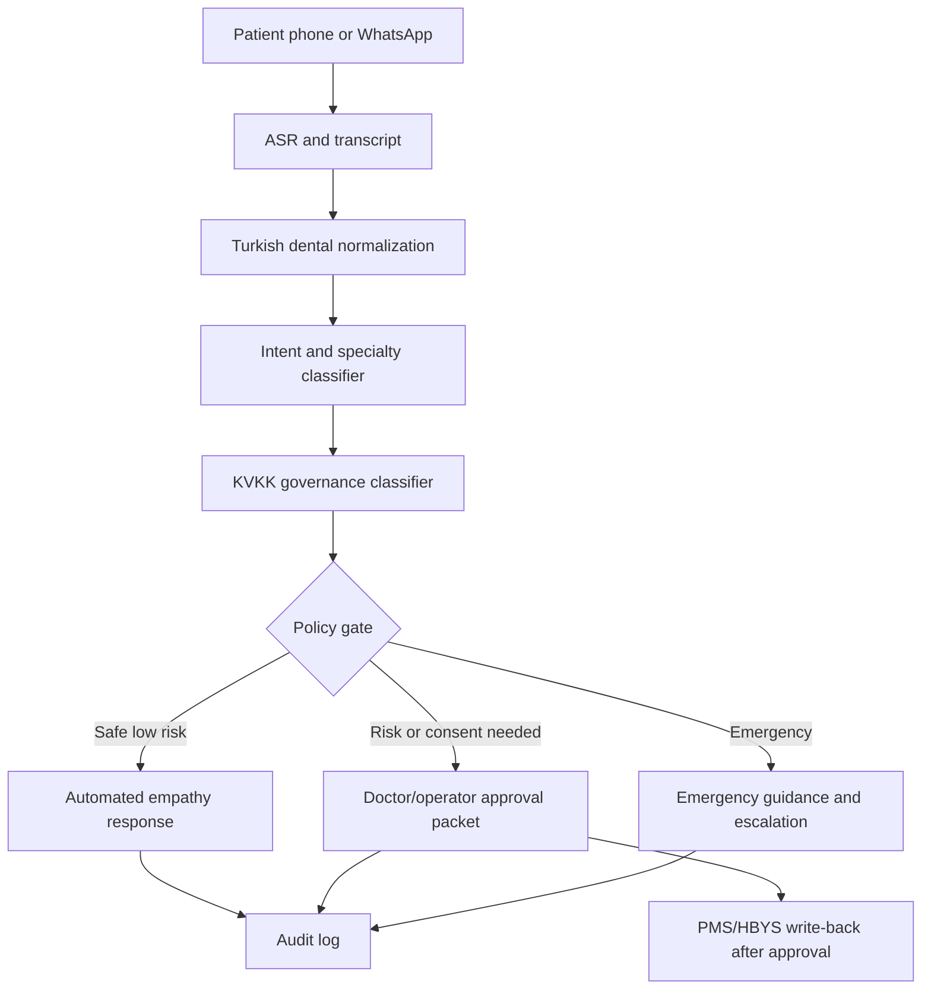

# Dental AI Patent Dossier Draft

Date: 2026-05-25

This is a technical invention dossier for patent counsel. It is not a filed patent application and should be reviewed by a registered patent attorney before any public disclosure.

## Working Title

KVKK-first multimodal dental AI receptionist with deterministic clinical governance and appointment write-back

## Technical Field

Healthcare call automation, speech AI, clinical workflow orchestration, privacy-preserving appointment systems, and dental clinic management integrations.

## Technical Problem

Dental clinics receive high volumes of phone and WhatsApp requests involving pain, anxiety, appointment changes, insurance questions, and urgent symptoms. Generic AI assistants can misunderstand colloquial Turkish complaints, collect more health data than needed, hallucinate medical advice, or use foreign processors without adequate consent and audit controls.

The technical problem is to convert real-time natural speech into safe appointment and clinical workflow actions while enforcing deterministic clinical and privacy constraints before any automated reply, doctor review packet, or PMS write-back is generated.

## Proposed Technical Solution

The system combines a probabilistic language layer with a deterministic governance layer:

1. ASR converts patient speech to text.
2. Turkish normalization maps colloquial symptoms to dental specialties.
3. Intent classification detects booking, cancellation, insurance, price, emergency, and general questions.
4. KVKK governance classifies data as contact, special category health, financial/insurance, identifier, or voice metadata.
5. The policy gate decides whether an answer may be auto-sent, must be held for doctor/operator review, or must be routed to emergency guidance.
6. The approval packet includes intent, confidence, specialty, urgency, data class, consent gates, processing mode, and redacted transcript preview.
7. PMS/HBYS write-back is allowed only after slot, consent, residency, and human-review constraints pass.

## Candidate Independent Claims

1. A computer-implemented method for transforming real-time Turkish dental patient speech into a specialty-specific appointment workflow, comprising receiving a speech transcript, normalizing colloquial dental complaint terms, classifying a clinical intent, mapping the complaint to a dental specialty, classifying personal data sensitivity, and applying a deterministic privacy and clinical-safety gate before generating an automated response or a human review packet.

2. A system for preventing unsafe automated healthcare communication, comprising a clinical intent classifier, a special-category data classifier, a consent and data-residency policy engine, and a response gate configured to block automatic replies for emergency, insurance, national identifier, low-confidence, or high-risk dental symptom events.

3. A clinical orchestration apparatus configured to generate a doctor approval packet from a patient interaction, wherein the packet includes intent, confidence, specialty routing reason, urgency, allowed next action, redacted transcript preview, consent requirements, and audit metadata for downstream appointment write-back.

## Candidate Dependent Claims

1. The method of claim 1, wherein colloquial Turkish expressions including "zonkluyor", "dolgu düştü", "diş eti kanıyor", "çocuğumun dişi", "implant kontrolü", and "çenem kilitlendi" are mapped to Endodonti, Restoratif, Periodontoloji, Pedodonti, İmplantoloji, or Ağız, Diş ve Çene Cerrahisi.

2. The method of claim 1, wherein a local-first deployment mode blocks cross-border AI processors by default and records the selected processing mode in an audit trail.

3. The system of claim 2, wherein insurance verification is blocked until explicit consent and operator review are recorded.

4. The apparatus of claim 3, wherein the redacted transcript preview masks phone numbers, national identifiers, email addresses, and card-like numbers.

5. The method of claim 1, wherein PMS write-back is performed only after specialty, appointment slot, consent status, and human-review status are validated.

## Figure List For Counsel

## Evidence Bundle Checklist

- `docs/dental-ai-golden-research-findings.md`
- `backend/app/services/clinical_compliance_service.py`
- `backend/app/services/clinical_ai_service.py`
- Clinical tests proving insurance, emergency, and data-governance gates
- Operator panel screenshots
- Landing page screenshots
- Prior art search notes from TÜRKPATENT, EPO Espacenet, Google Patents, AI receptionist vendors, dental PMS vendors, and healthcare workflow tools

## Filing Notes

TÜRKPATENT guidance indicates that patent applications are filed online through EPATS and normally include an abstract, description, claims, and drawings when needed. Flow diagrams can be prepared as technical drawings. Counsel should run novelty and inventive-step analysis before filing.
